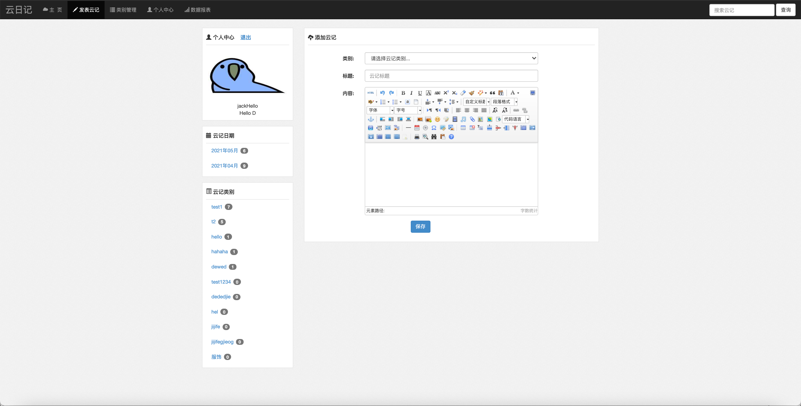

# DJ-CloudNote

# Introduction

This project is a personal online blog website, every user can have an account to write blog in this website. 

# Technology

- HTML + CSS + JavaScript
- Java
- Servlet
- JSP
- MySQL
- Tomcat

# Function:

1. Upload a blog using a rich text editor

    

2. Manage the types of notes

    

3. Check the content of your blogs, and update, or delete a blog.

    

4. Present the statistic data:

    
